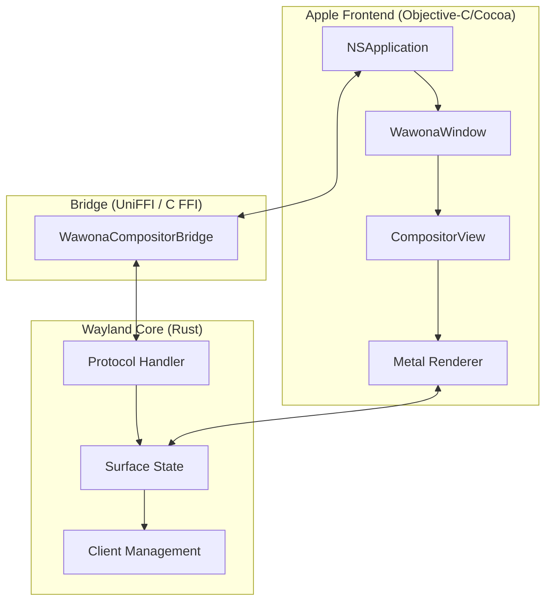

# Wawona macOS Implementation & GUI Architecture

This document provides a technical deep-dive into the macOS implementation of Wawona, explaining how it achieves a native experience while acting as a high-performance Wayland compositor.

## Executive Summary
Wawona is a **truly native** Wayland compositor designed specifically for Apple platforms (macOS and iOS). Unlike other compositors that might rely on generic cross-platform toolkits (like Electron, Qt, or GTK), Wawona is built directly on Apple's first-party frameworks: **AppKit**, **UIKit**, and **Metal**.

> [!IMPORTANT]
> Wawona is not just a "port" of a Linux compositor; it is a **re-imagining of a Wayland compositor as a native Mac application**.

---

## 1. Core Philosophy: "Native First"
Wawona is native at every layer of the user-facing stack. This architecture ensures that Wayland applications fit seamlessly into the macOS environment.

| Component | Framework | Native Status |
| :--- | :--- | :--- |
| **Window Host** | `AppKit` (`NSWindow`) | **Native.** Every Wayland app window is a real macOS system window. |
| **UI Environment** | `AppKit` / `UIKit` | **Native.** Panels like "Preferences" and "About" use standard Cocoa controls. |
| **Graphics API** | `Metal` | **Native.** Leverages Apple's high-performance GPU API. |
| **Input** | `NSEvent` | **Native.** macOS events translate directly to Wayland keycodes. |

### The "Liquid Glass" Aesthetic
Wawona implements the **"Liquid Glass"** design language found in modern macOS versions. By using `NSVisualEffectView`, Wawona provides vibrant, translucent, and depth-aware window chrome that adapts to the content behind it.

---

## 2. The Rendering Pipeline
Wawona's rendering architecture is optimized for Apple Silicon and shared memory systems, prioritizing low latency and high throughput.

### Surface Management
Each Wayland client creates **surfaces**. In Wawona, these map directly to native CoreAnimation layers:
1. **`WawonaSurfaceLayer`**: An Objective-C wrapper managing the surface lifecycle.
2. **`CAMetalLayer`**: The underlying layer providing hardware-accelerated rendering.

### High-Performance Buffer Sharing (`IOSurface`)
To achieve zero-copy (or near zero-copy) performance, Wawona uses **`IOSurface`**:
1. **Client Submission**: The Wayland client writes pixel data to a shared buffer.
2. **Surface Wrapping**: Wawona wraps this buffer in an `IOSurfaceRef`, which is accessible by the GPU.
3. **Zero-Copy Rendering**: The Metal renderer reads directly from this `IOSurface` without intermediate CPU copies, minimizing latency and battery drain.

### Metal Compositing
The final visual output is composited using a custom Metal shader pipeline:
- **MSL Shaders**: Custom Metal Shading Language shaders handle texture sampling, alpha blending, and scaling.
- **Synchronization**: `CVDisplayLink` (macOS) and `CADisplayLink` (iOS) synchronize rendering with the display's vertical refresh (V-Sync) to eliminate screen tearing.

---

## 3. Architecture: The Rust-Apple Bridge
Wawona uses a hybrid architecture to combine the safety of Rust with the power of Apple's GUI frameworks.

- **Rust Core**: Manages Wayland protocol state and client communication.
- **Objective-C Frontend**: Manages window server integration, system event handling, and rendering.
- **UniFFI**: Provides the high-speed interface between the Rust core and the Objective-C frontend.

---

## 4. Key Performance Benefits
- **Low Latency**: `IOSurface` and Metal bypass traditional bottlenecks.
- **Battery Efficiency**: Leveraging native hardware acceleration reduces CPU overhead.
- **System Integration**: Support for Mission Control, Stage Manager, and standard macOS keyboard shortcuts.

> [!TIP]
> Because Wawona uses actual `NSWindow` objects, your Wayland applications benefit from native macOS window management features like snapping, resizing, and full-screen transitions.
